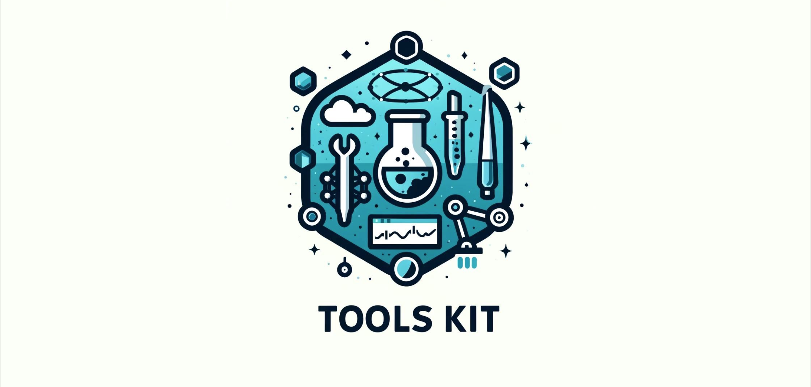

# Tools Kit
Welcome to the documentation for **Tools Kit**.


## Introduction

**Tools Kit** is designed to help you write your lab reports, faciliating common procedures and calculations. It provides tools to find the molecular mass of your molecule, create an excel graph or a linear regression graph from input excel data. Moreover, Tools Kit allows you to easily calculate the standard deviation of glassware used, and prints the molecular structure of a given SMILEs data.
This documentation will help you get started, understand the usage, and contribute to the project.

## Getting Started

To get started with **Tools Kit**, follow the instructions below.

### Prerequisites

Make sure you have the following installed:
- Python 3.10
- [Any other dependencies or software required]

### Installation

You can install **Tools Kit** using pip:

```bash
pip install Project_ppchem-tools-kit